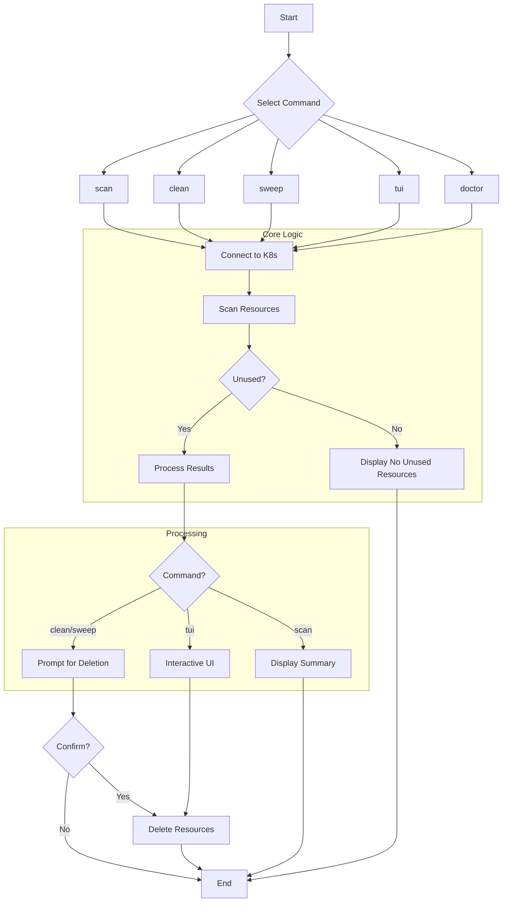

# kswp Architecture

This document describes the architecture of `kswp`.

## Flowchart

This flowchart shows the general workflow of the `kswp` tool.

```mermaid
flowchart TD
    A[Start] --> B{Select Command};
    B --> C[scan];
    B --> D[clean];
    B --> E[sweep];
    B --> F[tui];
    B --> G[doctor];

    subgraph "Core Logic"
        direction LR
        H[Connect to K8s] --> I[Scan Resources];
        I --> J{Unused?};
        J -- Yes --> K[Process Results];
        J -- No --> L[Display No Unused Resources];
    end

    C --> H;
    D --> H;
    E --> H;
    F --> H;
    G --> H;

    subgraph "Processing"
        direction TB
        K --> M{Command?};
        M -- scan --> N[Display Summary];
        M -- clean/sweep --> O[Prompt for Deletion];
        M -- tui --> P[Interactive UI];
    end

    O --> Q{Confirm?};
    Q -- Yes --> R[Delete Resources];
    Q -- No --> S[End];
    R --> S;
    P --> R;
    N --> S;
    L --> S;
```

